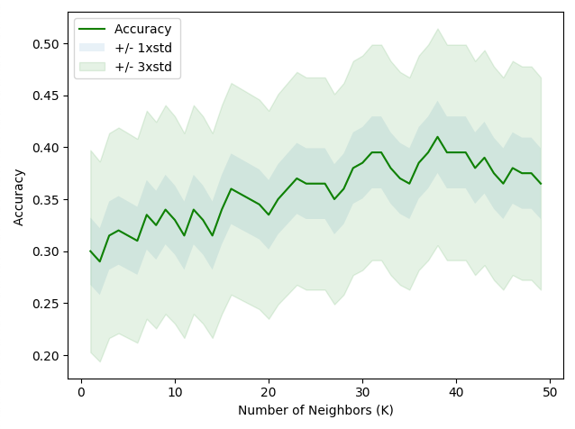

# Customer Classification Using K-Nearest Neighbors (KNN)

## Project Overview

This project uses the **K-Nearest Neighbors (KNN)** algorithm to classify customers into distinct categories based on demographic and behavioral attributes. The dataset contains features such as income, age, and region, which are used to predict the customer category (**custcat**).

## Requirements

To run this project, the following libraries are required:

- **matplotlib**: For data visualization.
- **pandas**: For data manipulation and analysis.
- **numpy**: For numerical computations.
- **scikit-learn**: For machine learning algorithms and evaluation metrics.

You can install the necessary libraries using pip:

```bash
pip install matplotlib pandas numpy scikit-learn
```

## Dataset

The dataset contains the following features:

- **region**: Geographical region of the customer.
- **tenure**: Duration of the customer relationship.
- **age**: Age of the customer.
- **marital**: Marital status.
- **address**: Length of time at current address.
- **income**: Annual income.
- **ed**: Education level.
- **employ**: Number of years employed.
- **retire**: Retirement status (binary).
- **gender**: Gender of the customer.
- **reside**: Number of people residing in the household.

### Target Variable:
- **custcat**: The customer category, which is the variable to be predicted.

## Model

This project implements the **K-Nearest Neighbors (KNN)** algorithm to classify customers. The model's performance is evaluated based on its accuracy in predicting the customer categories.

### Key Steps:

1. **Data Preprocessing**:
   - The features are normalized using **StandardScaler** to ensure all values are on a similar scale.
   - The dataset is split into a training set (80%) and a test set (20%).

2. **Training the Model**:
   - The KNN model is trained using different values of **K** (number of neighbors).

3. **Evaluation**:
   - The accuracy of the model is evaluated for both the training and test sets.
   - The best **K** value is determined by testing values from 1 to 10 and selecting the one with the highest test accuracy.

## Results

### Accuracy Scores:

- **Training Set Accuracy**: 54.75%
- **Test Set Accuracy**: 32.00%

### Optimal K Value:

The best accuracy of **41%** was achieved with **K=38**.

### Visualization:

The accuracy of the model for different values of K is visualized, including the standard deviation bounds. This helps understand the impact of K on model performance.



## Conclusion

The **K-Nearest Neighbors (KNN)** algorithm showed limited accuracy in this classification task, with a maximum accuracy of **32%**. This suggests that additional feature engineering, alternative models, or further tuning may be required to improve performance.
